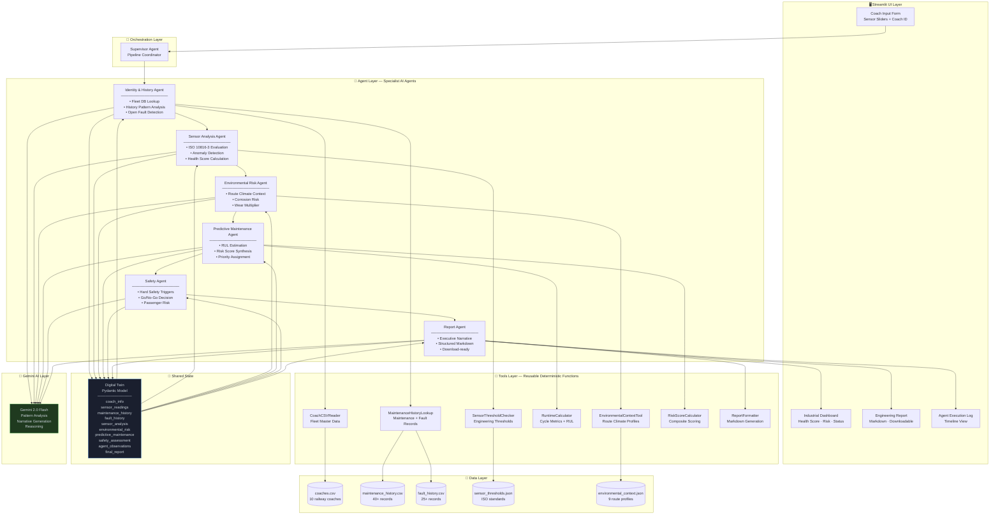

# TwinOps AI — Architecture Document

## System Architecture Diagram



---

## Digital Twin Data Flow

```
Operator Input
      │
      ▼
┌─────────────────────────────────────────────────────────┐
│  Digital Twin (Initial State)                           │
│  coach_id = "RC-1001"                                   │
│  sensors = {temp: 48.0, vib: 5.5, runtime: 750, ...}   │
│  [all other fields empty / default]                     │
└─────────────────────────────────────────────────────────┘
      │
      ▼ Identity & History Agent
┌─────────────────────────────────────────────────────────┐
│  Digital Twin (+ Identity + History)                    │
│  coach_info = {type: "AC Sleeper", route: "...", ...}   │
│  maintenance_history = [10 records]                     │
│  fault_history = [5 records]                            │
│  last_inspection_date = "2024-11-02"                    │
└─────────────────────────────────────────────────────────┘
      │
      ▼ Sensor Analysis Agent
┌─────────────────────────────────────────────────────────┐
│  Digital Twin (+ Sensor Analysis)                       │
│  sensor_analysis = {                                    │
│    temperature_status: "warning",                       │
│    vibration_status: "warning",                         │
│    anomalies: ["Temp elevated...", "Vib above..."],     │
│    sensor_health_score: 76                              │
│  }                                                      │
└─────────────────────────────────────────────────────────┘
      │
      ▼ Environmental Risk Agent
┌─────────────────────────────────────────────────────────┐
│  Digital Twin (+ Environmental Risk)                    │
│  environmental_risk = {                                 │
│    humidity_risk: "medium",                             │
│    climate_exposure_factor: 1.25,                       │
│    additional_wear_percent: 25                          │
│  }                                                      │
└─────────────────────────────────────────────────────────┘
      │
      ▼ Predictive Maintenance Agent
┌─────────────────────────────────────────────────────────┐
│  Digital Twin (+ Risk Scores + Maintenance Plan)        │
│  overall_health_score = 58                              │
│  overall_risk_score = 42                                │
│  predictive_maintenance = {                             │
│    rul_hours: 210,                                      │
│    priority: "MEDIUM",                                  │
│    next_action: "Schedule bogie inspection"             │
│  }                                                      │
└─────────────────────────────────────────────────────────┘
      │
      ▼ Safety Agent
┌─────────────────────────────────────────────────────────┐
│  Digital Twin (+ Safety Assessment)                     │
│  safety_assessment = {                                  │
│    safety_status: "WARNING",                            │
│    operational_decision: "MONITOR",                     │
│    passenger_risk: "medium",                            │
│    reasoning: "..."                                     │
│  }                                                      │
└─────────────────────────────────────────────────────────┘
      │
      ▼ Report Agent
┌─────────────────────────────────────────────────────────┐
│  Digital Twin (COMPLETE)                                │
│  final_report = "# TwinOps AI Report..."               │
│  pipeline_status = "completed"                          │
│  agent_observations = [12 log entries]                  │
└─────────────────────────────────────────────────────────┘
      │
      ▼
  Streamlit Dashboard
```

---

## Risk Score Calculation

The composite risk score (0–100) is computed by the Predictive Maintenance Agent using a weighted formula:

```
Risk Score = (0.35 × sensor_risk)
           + (0.25 × runtime_risk)
           + (0.20 × environmental_risk)
           + (0.20 × history_risk)

Where:
  sensor_risk       = 100 - sensor_health_score
  runtime_risk      = function of cycle_percent_used (0–100)
  environmental_risk = min(100, additional_wear_percent × 2.5)
  history_risk      = (critical_faults × 15) + (faults × 3) + (open_faults × 20)

Health Score = 100 - Risk Score
```

## Safety Decision Logic

```
Hard Triggers (rule-based, override LLM):
  ANY critical sensor → CRITICAL / STOP
  Open unresolved fault → CRITICAL / RESTRICT+
  Risk score > 60 → CRITICAL
  
LLM Assessment (Gemini reasoning):
  Contextual analysis of combined factors
  Conservative safety principle applied
  
Final = MAX(hard_trigger_level, llm_level)
```

---

## Key Design Decisions

1. **Shared Digital Twin over message passing** — Agents share a Pydantic state object rather than passing text between each other. This ensures type safety, enables structured aggregation, and makes the reasoning chain auditable.

2. **Deterministic tools + LLM narrative** — Core calculations (threshold checks, risk scores, RUL estimates) use deterministic code. Gemini is used for contextual reasoning, pattern identification, and narrative generation — the tasks where LLMs genuinely add value.

3. **Conservative safety escalation** — The Safety Agent takes the *more conservative* of its rule-based and LLM-based assessments. Safety cannot be downgraded by AI reasoning alone.

4. **Graceful degradation** — Each agent has a fallback path. If Gemini is unavailable (no API key, rate limit), tools return deterministic results and the pipeline completes with heuristic analysis.

5. **Sequential pipeline with error isolation** — Agents run sequentially (each needs the prior agent's output), but individual agent failures don't crash the pipeline. The Supervisor logs the error and continues.
