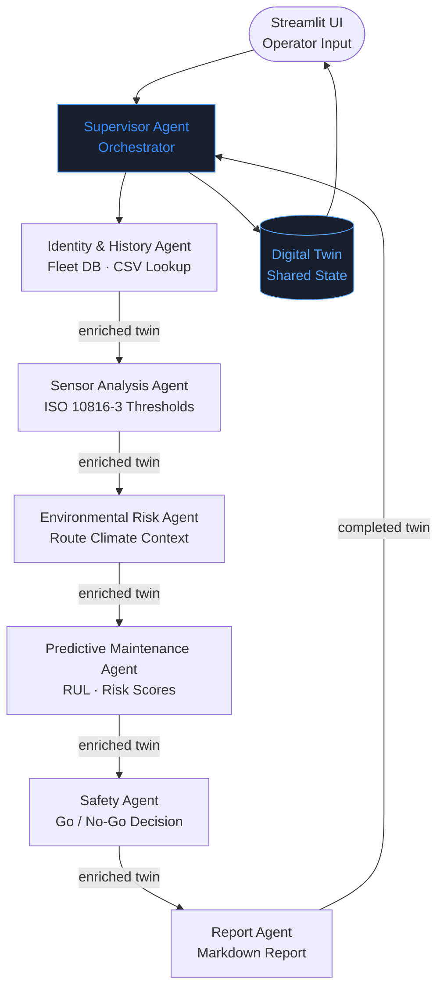

# ⚙️ TwinOps AI

> **An Industry 4.0 Digital Twin Copilot powered by Collaborative AI Agents**

[](https://python.org)
[](https://streamlit.io)
[](https://google.github.io/adk-docs)
[](https://ai.google.dev)
[](LICENSE)

---

## 🎯 Project Overview

**TwinOps AI** is a production-quality MVP built for the **Kaggle × Google AI Agents Intensive Capstone**. It demonstrates real-world multi-agent AI collaboration applied to an industrial engineering problem: **predictive maintenance for railway rolling stock**.

Instead of building another chatbot, TwinOps AI creates an intelligent Digital Twin where **six specialized AI agents collaborate** to analyze equipment health and generate professional engineering maintenance reports.

---

## 🔧 Problem Statement

Railway maintenance departments face a critical bottleneck: engineers must manually combine sensor readings, equipment history, fault records, and environmental data before making maintenance decisions. This process is:

- ⏱️ **Slow** — hours of manual data gathering per coach
- 📊 **Inconsistent** — subjective assessment varies by engineer
- 📈 **Hard to scale** — one expert cannot assess an entire fleet
- ⚠️ **Reactive** — problems are often discovered too late

**TwinOps AI** automates this collaborative reasoning through six specialist agents, each contributing their expertise to a shared Digital Twin that captures the complete knowledge state of a railway coach.

---

## 🏗️ Architecture

### Multi-Agent Pipeline



### Shared Digital Twin

The core architectural feature is the **Shared Digital Twin State Object** — a Pydantic model that flows through every agent. Each agent reads the current state and enriches its specific section:

```
DigitalTwin
├── coach_info          ← Set at intake
├── sensor_readings     ← Set at intake
├── maintenance_history ← Identity & History Agent
├── fault_history       ← Identity & History Agent
├── sensor_analysis     ← Sensor Analysis Agent
├── environmental_risk  ← Environmental Risk Agent
├── predictive_maintenance ← Predictive Maintenance Agent
│   ├── overall_health_score
│   └── overall_risk_score
├── safety_assessment   ← Safety Agent
├── final_report        ← Report Agent
└── agent_observations  ← All agents (execution log)
```

### Agent Tools

Each agent uses reusable tools rather than embedding logic in prompts:

| Tool | Agent | Purpose |
|------|-------|---------|
| `CoachCSVReader` | Identity | Fleet database lookup |
| `MaintenanceHistoryLookup` | Identity | Maintenance/fault record retrieval |
| `SensorThresholdChecker` | Sensor | ISO 10816-3 threshold evaluation |
| `RuntimeCalculator` | Predictive | Maintenance cycle & RUL estimation |
| `EnvironmentalContextTool` | Environmental | Route climate context |
| `RiskScoreCalculator` | Predictive | Composite risk/health scoring |
| `ReportFormatter` | Report | Structured Markdown generation |

---

## 🤖 Agent Descriptions

### 1. Supervisor Agent
Orchestrates the entire pipeline. Delegates to each specialist in sequence, never performing specialist work itself. Implements ADK-style multi-agent coordination with shared Digital Twin state.

### 2. Identity & History Agent
Validates coach ID against the fleet database, retrieves all maintenance and fault history, and uses Gemini to identify patterns (recurring failures, escalating severity, component-level trends).

### 3. Sensor Analysis Agent
Evaluates sensor readings against engineering thresholds (ISO 10816-3 for vibration, railway standards for temperature/runtime). Computes a Sensor Health Score (0–100) and generates contextual engineering observations.

### 4. Environmental Risk Agent
Assesses climate and environmental wear for the coach's assigned route. Provides wear multipliers, corrosion risk classifications, and component-level environmental impact assessments.

### 5. Predictive Maintenance Agent
Synthesizes all prior findings to estimate Remaining Useful Life (RUL), compute composite health/risk scores (weighted across sensor, runtime, environmental, and history factors), and determine maintenance priority.

### 6. Safety Agent
The final safety guardian. Applies both rule-based hard triggers (critical sensors, open faults, overcrowding) and Gemini reasoning to issue an operational decision: CONTINUE / MONITOR / RESTRICT / STOP. Passenger safety always takes precedence.

### 7. Report Agent
Generates a professional Markdown engineering report combining structured sections (from the ReportFormatter tool) with a Gemini-authored executive narrative.

---

## 📸 Screenshots

> *[Dashboard — healthy coach with all green metrics]* 
 

> *[Dashboard — critical coach with red risk indicators and STOP decision]*
 
> *[Full engineering report with maintenance history table]*
> https://github.com/user-attachments/assets/d5521816-1fda-4bc6-be31-f3ee41323035

> *[Agent execution timeline showing all 6 agents]*

> *Dashboard*


---

## 🚀 Installation

### Prerequisites
- Python 3.10+
- A Google Gemini API key ([Get one here](https://aistudio.google.com/app/apikey))

### Setup

```bash
# 1. Clone the repository
git clone https://github.com/yourusername/twinops-ai
cd twinops-ai

# 2. Create virtual environment
python -m venv .venv
source .venv/bin/activate      # Linux/Mac
.venv\Scripts\activate         # Windows

# 3. Install dependencies
pip install -r requirements.txt

# 4. Configure environment
cp .env.example .env
# Edit .env and add your GOOGLE_API_KEY

# 5. Run the application
streamlit run app.py
```

### Without an API Key (Mock Mode)
The application runs fully in **mock mode** without a Gemini API key. All tools and heuristic calculations work normally — only the LLM narrative generation is replaced with deterministic fallbacks. This is useful for testing the architecture.

---

## 💡 Usage

1. **Open the app** at `http://localhost:8501`
2. **Select or enter a coach ID** from the fleet database (RC-1001 through RC-1010)
3. **Set sensor readings** using the sliders, or pick a demo scenario:
   - 🟢 Healthy Coach — All Nominal
   - 🟡 Warning — Approaching Maintenance
   - 🔴 Critical — Multiple Anomalies
   - 🚨 Emergency — Withdraw from Service
4. **Click "Run AI Agent Assessment"** to start the 6-agent pipeline
5. **Review results** across four tabs:
   - **Dashboard** — Sensor readings, safety concerns, agent observations
   - **Full Report** — Complete downloadable engineering report
   - **Agent Log** — Execution timeline with per-agent details
   - **Digital Twin** — Complete state object and raw JSON

---

## 📁 Folder Structure

```
twinops-ai/
├── app.py                    # Main Streamlit application
├── requirements.txt          # Python dependencies
├── .env.example             # Environment template
│
├── agents/                  # AI agent implementations
│   ├── supervisor_agent.py  # Pipeline orchestrator
│   ├── identity_history_agent.py
│   ├── sensor_analysis_agent.py
│   ├── environmental_risk_agent.py
│   ├── predictive_maintenance_agent.py
│   ├── safety_agent.py
│   └── report_agent.py
│
├── models/                  # Data models
│   └── digital_twin.py      # Shared Digital Twin state
│
├── tools/                   # Agent tools
│   ├── csv_reader.py        # Fleet database lookup
│   ├── history_lookup.py    # Maintenance record retrieval
│   ├── sensor_checker.py    # Threshold evaluation
│   ├── runtime_calculator.py# RUL and cycle metrics
│   ├── environment_tool.py  # Route climate context
│   ├── risk_calculator.py   # Composite risk scoring
│   └── report_formatter.py  # Markdown report generation
│
├── prompts/                 # Agent system prompts
│   └── agent_prompts.py
│
├── data/                    # Sample datasets
│   ├── coaches.csv          # Fleet master data (10 coaches)
│   ├── maintenance_history.csv  # 40+ maintenance records
│   ├── fault_history.csv    # 25+ fault records
│   ├── sensor_thresholds.json   # Engineering thresholds
│   └── environmental_context.json  # Route climate profiles
│
├── ui/                      # UI components
│   ├── components.py        # Reusable UI components
│   └── styles.py            # CSS and styling
│
└── utils/                   # Utilities
    ├── config.py            # Configuration management
    └── logger.py            # Logging setup
```

---

## 🧩 Competition Criteria Coverage

| Criterion | Implementation |
|-----------|----------------|
| **Google ADK** | Multi-agent coordination pattern, Gemini API integration |
| **Multi-Agent Collaboration** | 6 specialized agents with sequential shared-state delegation |
| **Agent Skills / Tools** | 7 reusable tools (CSV reader, sensor checker, risk calculator, etc.) |
| **Shared State** | Digital Twin Pydantic model flowing through all agents |
| **Secure Agent Design** | API key in env vars, input validation, graceful error handling |
| **Clear Agent Communication** | Structured JSON agent outputs, typed Digital Twin state |
| **Business Impact** | Automated maintenance triage for railway fleets |
| **Professional UI** | Industrial Streamlit dashboard with dark theme |
| **Clean Architecture** | Modular, typed, documented, extensible |

---

## 🔮 Future Scope

> These features are not implemented in the MVP but represent natural extensions:

- **🔌 ESP32 / IoT Integration** — Live sensor feeds from physical railway coaches via MQTT
- **🤖 ROS Integration** — Robot Operating System for real-time bogie and wheel monitoring
- **📡 Live Digital Twin** — WebSocket-based real-time state synchronization
- **👁️ Computer Vision** — Camera-based wheel wear and track condition assessment
- **🚄 Full Fleet Monitoring** — Scale from one coach to an entire rolling stock fleet
- **☁️ Cloud Deployment** — Google Cloud Run deployment with Firestore state persistence
- **📊 Predictive Analytics** — ML-based RUL models replacing heuristic estimation
- **📱 Mobile Dashboard** — Field engineer mobile interface for on-track assessments
- **🔗 Railway ERP Integration** — Direct integration with MMIS/CMMS systems

---

## 🛠️ Tech Stack

| Component | Technology |
|-----------|-----------|
| **AI Models** | Google Gemini 2.0 Flash |
| **Agent Framework** | Google ADK (multi-agent patterns) |
| **Backend** | Python 3.10+, Pydantic v2 |
| **UI** | Streamlit 1.35+ |
| **Data** | CSV/JSON (no external database required) |
| **Logging** | Loguru |
| **Configuration** | python-dotenv |

---

## 📜 License

MIT License — see [LICENSE](LICENSE) for details.

---

*Built for the Kaggle × Google "AI Agents: Intensive Vibe Coding" Capstone Project*  
*Demonstrating practical multi-agent collaboration and shared Digital Twin architecture*
